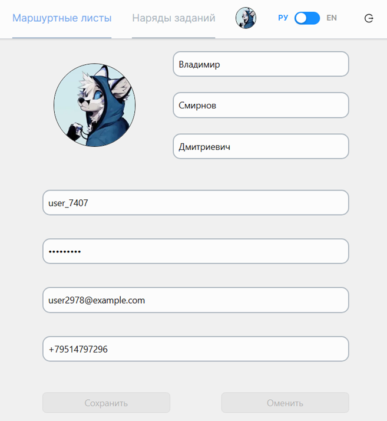
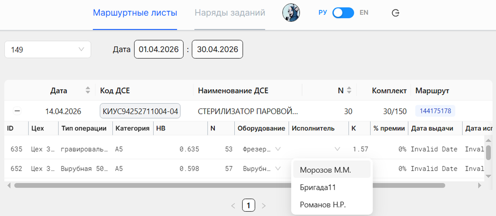
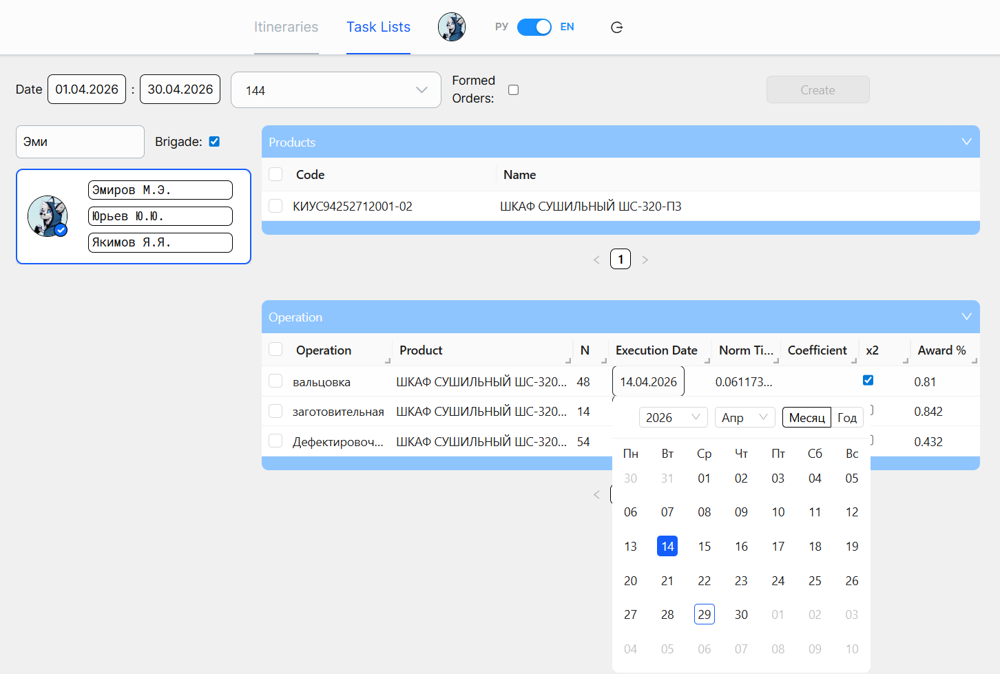

# Itinerary Operations

Данное приложение является фронтенд частью [другого приложения(бэкенд)](https://github.com/DischargedRobot/ItineraryOperations) и позволяет управлять маршрутными листами и нарядами заданий на предприятии

# Используемые технологии

|  |  |  |  |  |  |  |
| :--------------------------------: | :------------------------------: | :---------------------------------: | :----------------------------: | :----------------------------------: | :----------------------------: | :---------------------------------------: |
|             TypeScript             |              React               |               Next.js               |              SCSS              |              Ant Design              |              CASL              |                React Intl                 |

# Интерфейс

## Страница профиля

На данной странице пользователь может просмотреть и отредактировать свои личные данные, хранящиеся в организации.

## Страница с маршрутными листами

На данной странице пользователь может отредактировать маршрутные листы, подготовив операции в них к выпуску, назначив исполнителя.

## Страница с нарядами заданий

На данной странице пользователь может просмотреть данные о сотрудниках, о их нарядах заданий (отфильтровав их по исполнителям, датам, сформированы они или нет) и сформировать наряды из выделенных операций.
